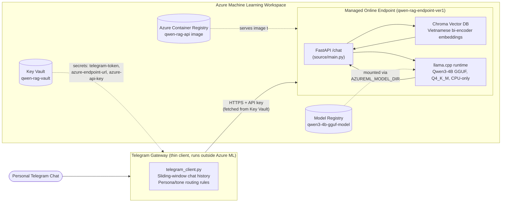
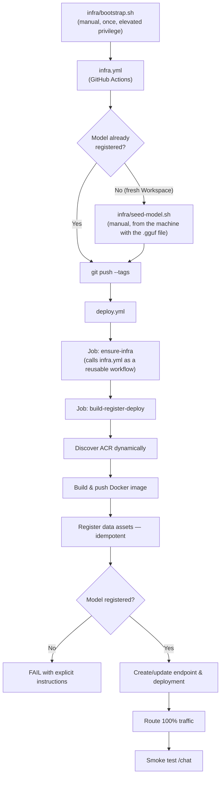

# My Digital Twin — Persona Cloning & RAG Chatbot on Azure

A personal AI system that learns to speak in **my own conversational style** (Vietnamese-first), grounded by a retrieval layer over my personal history, and served through a small, security-conscious cloud deployment on Azure Machine Learning.

This repository is also a working record of an infrastructure migration: it started as a single local script wired to a free Kaggle GPU notebook, and has since been rebuilt into a two-service architecture provisioned entirely from code (Bicep + GitHub Actions).

---

## What this project demonstrates

This is a solo, personal-scale project — not a production SaaS — but it is built the way a small production system should be:

- **Infrastructure as Code**: the entire Azure footprint (Workspace, Container Registry, Key Vault, Storage, App Insights) is defined in Bicep and reproducible from a clean subscription.
- **Least-privilege access design**: CI/CD never holds subscription-level credentials. A one-time bootstrap step scopes the automation identity to a single resource group, and the pipeline is architected around that constraint rather than around a convenient shortcut.
- **Idempotent, dependency-aware CI/CD**: two GitHub Actions workflows (`infra.yml`, `deploy.yml`) with an explicit, enforced execution order, dynamic resource discovery instead of hardcoded IDs, and fail-fast checks with actionable error messages.
- **A deliberately-scoped BYOM (Bring-Your-Own-Model) boundary**: the pipeline is honest about what a GitHub-hosted runner can and cannot do, and is designed around that boundary instead of pretending it doesn't exist.
- **A real, if early-stage, ML system**: LoRA persona fine-tuning, a Retrieval-Augmented Generation layer, and a quantized CPU-only inference runtime — plus load and chaos testing against the deployed endpoint.

The sections below cover the architecture, the infrastructure, the ML pipeline, and — candidly — what is solid today versus what is intentionally left for the next iteration.

---

## Demo

https://youtu.be/4AZ7PPyMX3o?si=1SSGbR_Q3689GpyP

---

## Architecture

### System overview

The system is split into two independently-run services, connected only over HTTPS. Neither service needs to know how the other is implemented — the API contract at `/chat` is the only coupling.



### Component breakdown

**AI Core (`source/main.py`) — containerized, deployed to Azure ML**
A stateless FastAPI service that does both retrieval and generation in a single request:
1. Embeds the incoming query and runs a similarity search (`k=2`) against a Chroma vector store built from personal data.
2. Injects the retrieved context into the prompt (`[THÔNG TIN NỀN VỀ BẠN]` block).
3. Runs inference locally inside the container via `llama-cpp-python` against a 4-bit quantized (`Q4_K_M`) GGUF export of the fine-tuned Qwen3-4B model, with `n_gpu_layers=0` — deliberately CPU-only, so the deployment runs on a plain `Standard_DS2_v2` instance with no GPU cost.
4. Returns the reply along with the retrieved context and processing time, for observability.

The Docker image is a two-stage build: a `builder` stage compiles `llama-cpp-python` against OpenBLAS for faster CPU inference, and the final runtime image only carries the compiled wheels — keeping the deployed image lean.

**Telegram Gateway (`source/telegram_client.py`) — thin client, currently run outside the managed endpoint**
A lightweight, stateless-on-restart process that:
- Authenticates to Azure Key Vault via `DefaultAzureCredential` and pulls the Telegram bot token and the endpoint's API key at startup — no secret is ever hardcoded or committed.
- Maintains a short sliding-window chat history per user.
- Applies rule-based tone/persona switching depending on how the other person addresses the bot (peer/casual, elder/formal, stranger/polite) before the message ever reaches the model — a prompt-engineering layer that compensates for the fine-tuned model not yet having learned this distinction purely from data (see [Project Maturity](#project-maturity-whats-solid-and-whats-next)).
- Forwards the augmented conversation to the Managed Online Endpoint and relays the reply back to Telegram.

This service is intentionally **not** part of the Docker image or the Azure ML deployment today — it runs as a local/VM process authenticated with `az login` or a managed identity. That boundary is called out explicitly in [Roadmap](#roadmap) rather than left implicit.

### Evolution: monolith → microservices

The original version of this project (see git history) was a single local script that polled Telegram, ran RAG locally, and called a free Kaggle notebook exposed through an `ngrok` tunnel for inference. That design was cheap and fast to prototype, but fragile: it depended on a Kaggle session and a tunnel URL that could disappear at any time, had no infrastructure story, and mixed every concern into one process.

The current architecture separates **messaging** from **model serving**, puts the model behind a real managed cloud endpoint with its own registry and versioning, and replaces "run a notebook and copy a URL" with "push a tag and let CI/CD do it." It is a first, real step from a hobby script toward an operable system — not a claim that it is a finished one.

---

## Repository structure

```
My-Digital-Twin/
├── .github/workflows/
│   ├── infra.yml               # IaC pipeline: provisions everything inside an existing RG
│   └── deploy.yml               # CD pipeline: builds, registers, deploys, smoke-tests
│
├── infra/                       # Infrastructure as Code
│   ├── bootstrap.sh              # Manual, one-time, elevated-privilege: creates the RG + scoped SP
│   ├── seed-model.sh             # Manual, run from the machine holding the .gguf file
│   ├── main.bicep                # Entry point (resource-group scope)
│   └── modules/
│       └── mlops-resources.bicep # Storage, Key Vault, App Insights, ACR, AML Workspace
│
├── azure/                       # Azure ML asset definitions (application layer, not infra)
│   ├── conda.yml                  # Environment for the data-pipeline job
│   ├── model.yml                  # Registers the frozen GGUF model (BYOM)
│   ├── endpoint.yml               # Managed online endpoint definition
│   ├── deployment.yml             # Deployment spec (image field is a CI-managed placeholder)
│   ├── knowledge_db.yml           # Data asset: pre-built vector DB
│   ├── profile_data.yml           # Data asset: profile.json
│   └── pipeline_job.yml           # Job that (re)builds the vector DB from source data
│
├── source/                      # Application code (packaged into the Docker image)
│   ├── main.py                    # FastAPI inference + RAG service
│   ├── build_db.py                 # Vector DB builder (used by pipeline_job.yml)
│   ├── process_data.py             # Facebook export → ChatML training data
│   ├── schemas.py                   # Pydantic request/response models
│   └── telegram_client.py           # Telegram gateway (see above)
│
├── model/                       # Model file path (BYOM) - Local Stored
│   └── qwen3-4b-instruct-2507.Q4_K_M.gguf  
├── my_data/                     # Personal data used for training and retrieval
│   ├── facebook_chat/              # Raw exported chat history (not committed)
│   ├── knowledge_db/                 # Pre-built Chroma DB
│   ├── profile.json
│   └── train_data.jsonl
│
├── test/                        # Manual load/resilience testing against the live endpoint
│   ├── stress-test.py
│   └── chaos-test.py
│
├── Dockerfile                   # Multi-stage build for the AI Core service
├── requirements.txt
└── LICENSE
```

---

## Cloud infrastructure

Everything under `infra/` is written to be **rebuilt from a clean Azure subscription**, with one explicit, deliberate exception described below.

### What Bicep provisions

| Resource | Purpose |
|---|---|
| Resource Group | Boundary for everything below (created once, manually — see next section) |
| Storage Account | Backing store for the Azure ML Workspace |
| Key Vault | Secrets for both the deployment (`azure-endpoint-url`, `azure-api-key`) and the gateway (`telegram-token`) |
| Application Insights | Workspace-level monitoring/telemetry |
| Container Registry (Standard SKU) | Hosts the `qwen-rag-api` image; name is auto-derived (`uniqueString`), never hand-picked |
| Azure ML Workspace | Hosts the model registry, data assets, online endpoint, and deployment |

### Security model: bootstrap once, automate within a boundary

Automating "create the resource group" and "automate everything else" are two different privilege problems, and this project treats them as such instead of collapsing them into one over-privileged pipeline:

1. **`infra/bootstrap.sh`** — run manually, once, by a human holding subscription-level rights. It creates the resource group and creates a Service Principal whose `Contributor` role is scoped to **that resource group only**. This is the only point in the entire system that touches subscription-level permissions.
2. **`infra.yml`** — runs on that scoped Service Principal from that point forward. It deploys `infra/main.bicep` at **resource-group scope**, never subscription scope, and contains no `Microsoft.Authorization/roleAssignments` resources at all (Key Vault access for the Workspace's managed identity uses classic access policies — a resource-level property write — specifically to avoid requiring `Owner`/`User Access Administrator` in ongoing CI).

The result: the credential stored in `AZURE_CREDENTIALS` can create, modify, and delete resources inside one resource group, and nothing else in the subscription.

### The one deliberate manual step: BYOM model seeding

The fine-tuned model is exported as a multi-gigabyte `.gguf` file that lives only on the training machine — it is neither committed to git nor reachable by a GitHub-hosted runner, which has no path to any personal machine's filesystem under any workflow configuration. Rather than pretend around this, the pipeline is explicit about it:

- **`infra/seed-model.sh`** is run manually, from the machine holding the file, once per Workspace lifetime (or whenever the model version changes).
- **`deploy.yml`** never attempts to register the model. It only *verifies* the model is already present and fails fast, with an explicit pointer to `seed-model.sh`, if it isn't.
- **`infra.yml`** also checks post-provisioning and emits a non-blocking warning if the Workspace is missing the model — surfacing the requirement immediately after a fresh build, rather than at deploy time.

---

## CI/CD pipeline



### `infra.yml` — provisioning

Triggered manually (`workflow_dispatch`), on changes to `infra/**`, or as a reusable workflow called by `deploy.yml`. Deploys `infra/main.bicep` at resource-group scope against an already-existing resource group (see bootstrap above), then checks and warns if the model hasn't been seeded yet.

### `deploy.yml` — build, register, deploy

Every push of a `v*.*.*` tag runs two jobs in a guaranteed order:

1. **`ensure-infra`** calls `infra.yml` as a reusable workflow (`uses: ./.github/workflows/infra.yml`, `secrets: inherit`). Because this is a job dependency within a single workflow run rather than two independently-triggered workflows, GitHub Actions enforces the ordering natively — infra reconciliation always completes (and must succeed) before any deployment step runs.
2. **`build-register-deploy`** (`needs: ensure-infra`) then:
   - Discovers the ACR name at runtime via `az acr list` instead of hardcoding it — the registry name is Bicep-generated and can differ every time the infra is rebuilt.
   - Builds and pushes the Docker image, skipping the push if that exact tag already exists.
   - Registers the two Azure ML data assets (idempotently, by checking for existing name+version first).
   - Verifies the model is registered (see BYOM note above) — hard failure with remediation instructions if not.
   - Creates or updates the online endpoint and deployment, checking `az ml online-deployment show` first to decide between create/update.
   - Routes 100% of traffic to the deployment and runs a smoke test against `/chat`, failing the pipeline if the live endpoint doesn't respond correctly.

---

## Machine learning pipeline

### Persona fine-tuning
- `source/process_data.py` parses raw Facebook chat exports into ChatML-formatted training data, using time-based session segmentation (60s message-merge window, 2h session window) to reconstruct realistic conversational turns rather than treating every message as an independent sample.
- Fine-tuning uses **LoRA** on **Qwen3-4B-Instruct** via **Unsloth**, trained on a free Kaggle T4×2 session, with prompt templates parameterized by relationship category (`friends`, `elders`, `polite`).
- The result is exported to **GGUF** and quantized to **Q4_K_M**, which is what makes CPU-only serving viable in the deployed container.

### Retrieval-Augmented Generation
- `source/build_db.py` (invoked by `azure/pipeline_job.yml` as an Azure ML job) builds a **Chroma** vector store from `my_data/profile.json`, embedded with `bkai-foundation-models/vietnamese-bi-encoder` — a model chosen specifically for Vietnamese semantic quality rather than a generic multilingual encoder.
- At inference time, the top-2 most similar documents are retrieved and injected into the prompt as grounding context before generation.

### Inference runtime
- `llama-cpp-python`, compiled against OpenBLAS in the Docker build stage, runs the quantized model with `n_gpu_layers=0` — a deliberate cost/latency trade-off that avoids GPU compute entirely for a workload of this size.

---

## Getting started

### 1. Prepare your data
Export your Facebook message history (JSON format) into `my_data/facebook_chat/`, and describe yourself in `my_data/profile.json` (see the format Section 4 of the earlier project notes / `profile.json` for the expected shape). Then:
```bash
python source/process_data.py
python source/build_db.py --input_data my_data/profile.json --output_db my_data/knowledge_db
```

### 2. Fine-tune the persona model
This is my training notebook (quite inexperienced but I don't have enough time and GPU to update this): https://www.kaggle.com/code/lnhingtribcthang/my-clone

Run the LoRA fine-tuning notebook on Kaggle (T4×2 recommended), customizing the system prompts and category tags to match your own voice. Export the result as a `Q4_K_M` GGUF file.

### 3. Bootstrap the Azure resource group (once)
```bash
az login
./infra/bootstrap.sh
```
Copy the resulting service principal JSON into the GitHub secret `AZURE_CREDENTIALS`, and set the repository variables `RESOURCE_GROUP` and `WORKSPACE`.

### 4. Provision infrastructure
Run the `Provision Infrastructure (Bicep)` workflow from the Actions tab (or push a change under `infra/`).

### 5. Seed the model
From the machine holding your `.gguf` file:
```bash
az login
./infra/seed-model.sh
```

### 6. Deploy
```bash
git tag v1.0.0
git push origin v1.0.0
```
`deploy.yml` takes it from there.

### 7. Run the Telegram Gateway
```bash
az login   # or run with a managed identity
python source/telegram_client.py
```

---

## Testing & resilience

`test/stress-test.py` and `test/chaos-test.py` authenticate to Key Vault the same way the production gateway does (`DefaultAzureCredential`, zero hardcoded secrets) and drive concurrent load against the live Managed Online Endpoint, logging results with timestamps for later comparison. These are run manually rather than wired into CI today (see Roadmap), but the logs in `test/` are real output from actual runs against the deployed endpoint, not synthetic examples.

---

## Project maturity: what's solid, and what's next

This section exists because a project like this is more useful to show honestly than to oversell. The gaps below are known, understood, and — in most cases — already have a concrete next step, not just an acknowledgment.

### What's implemented and working
- Full Bicep-based IaC for the Azure footprint, rebuildable from a clean subscription.
- A least-privilege security boundary between one-time bootstrap and ongoing automation, verified by removing every `Microsoft.Authorization/roleAssignments` resource from the recurring pipeline.
- A dependency-ordered, idempotent two-workflow CI/CD pipeline with dynamic resource discovery and fail-fast, actionable error messages instead of silent or confusing failures.
- A working persona LoRA fine-tune plus a functioning RAG layer, both integrated into a single CPU-only, cost-optimized inference service.
- Manual but real load and chaos testing against the live endpoint, using the same zero-hardcoded-secret pattern as production.

### Known trade-offs (by design, not oversight)

**On the chatbot's persona fidelity.** The model shows early, genuine signs of picking up my own texting style, but it is not yet a reliable clone, for two concrete reasons:
- There is no curated, labeled fine-tuning dataset — training data comes directly from raw exported chat logs, segmented by time windows but not otherwise cleaned, balanced, or annotated for tone. Output style is therefore only loosely steerable, and part of what looks like "persona" today actually comes from the rule-based tone-switching logic in the Telegram gateway's system prompt, not from the fine-tune itself.
- The RAG pipeline has very little personal data to retrieve from (a handful of profile facts), which caps how much factual grounding it can realistically add. `k=2` retrieval over a sparse corpus is a reasonable choice for the current data volume, but it is a ceiling, not a tuned parameter.

Both the personal-style fidelity and the long-term feasibility of this approach are genuinely open questions — this project is a first working iteration that proves the architecture, not a claim that the persona-cloning problem is solved.

**On CI/CD maturity.** This pipeline deliberately implements a subset of what a full enterprise MLOps setup would include, prioritized for a solo project with limited time: infrastructure-as-code, least-privilege access, idempotent deploys, and a smoke test are in place; automated unit testing/linting on pull requests, continuous training triggers, experiment tracking (e.g., MLflow), staging/production environment separation, canary rollout with automatic rollback, and OIDC-based (secretless) authentication are not yet implemented. These were prioritized deliberately, not missed — see Roadmap.

### Roadmap
- **Data**: build a small, manually curated and tone-labeled subset of conversations to use alongside the raw export, to decouple persona fidelity from raw data volume.
- **RAG**: grow the personal knowledge corpus and revisit `k` and chunking strategy once there's enough data to tune against.
- **Gateway**: containerize `telegram_client.py` and deploy it (e.g., to Azure Container Apps) so the system is fully cloud-native end to end, and move chat history from in-memory state to a persisted store so a restart doesn't lose active conversations.
- **CI/CD**: add PR-triggered unit tests and linting; wire `stress-test.py`/`chaos-test.py` into a scheduled or post-deploy workflow instead of running them by hand; introduce MLflow-based experiment tracking for fine-tuning runs; move from a single production endpoint to a staged (canary or blue/green) rollout with automatic rollback on smoke-test failure; migrate `AZURE_CREDENTIALS` from a stored JSON secret to OIDC-based federated identity.
- **Security**: rotate and audit Key Vault secret access as the system grows beyond a single-user deployment.

---

## License

Released under the [MIT License](LICENSE).